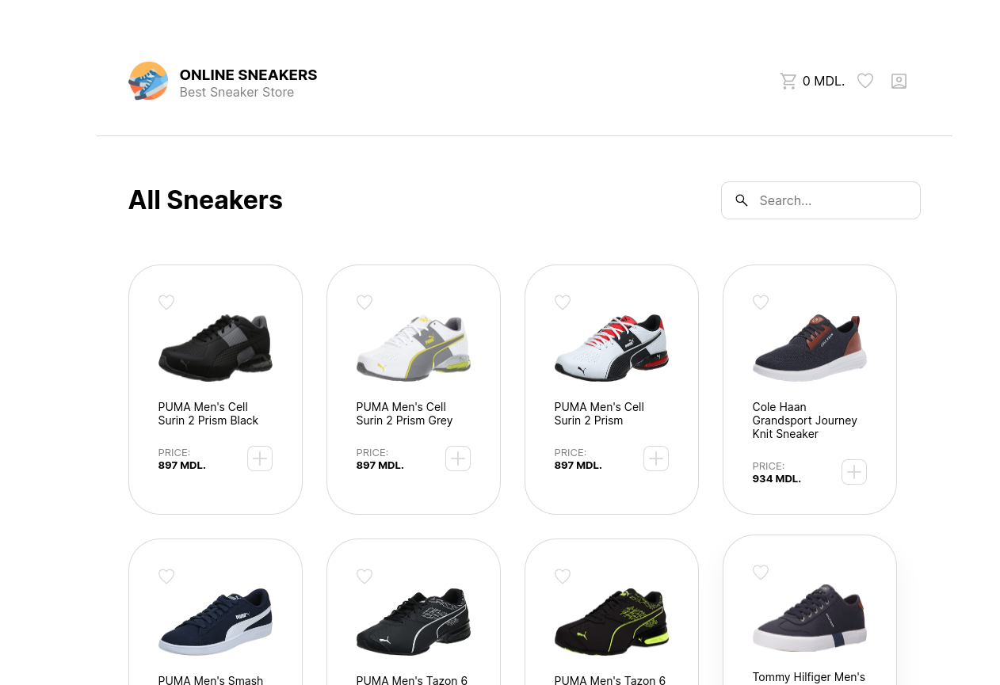
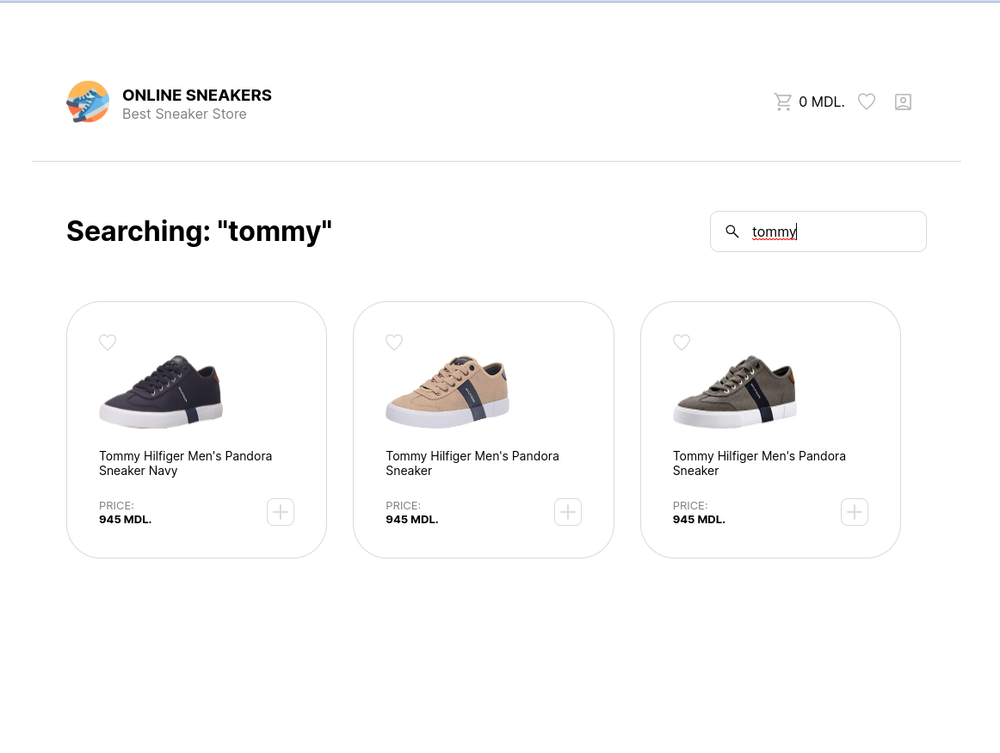
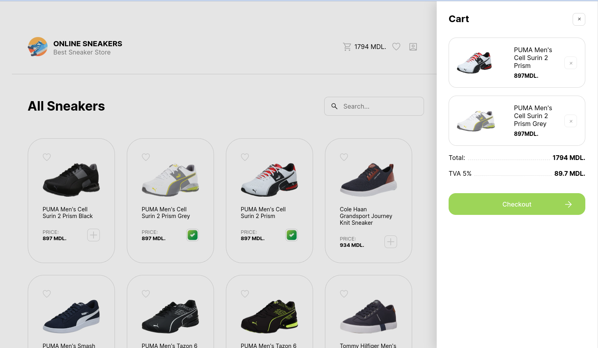
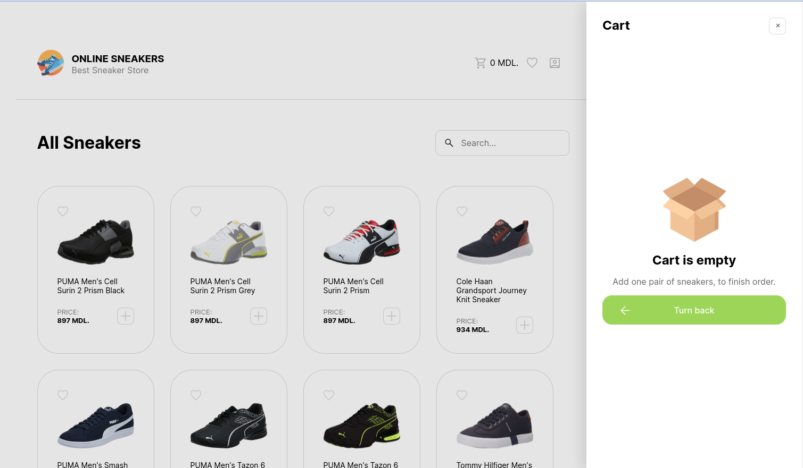
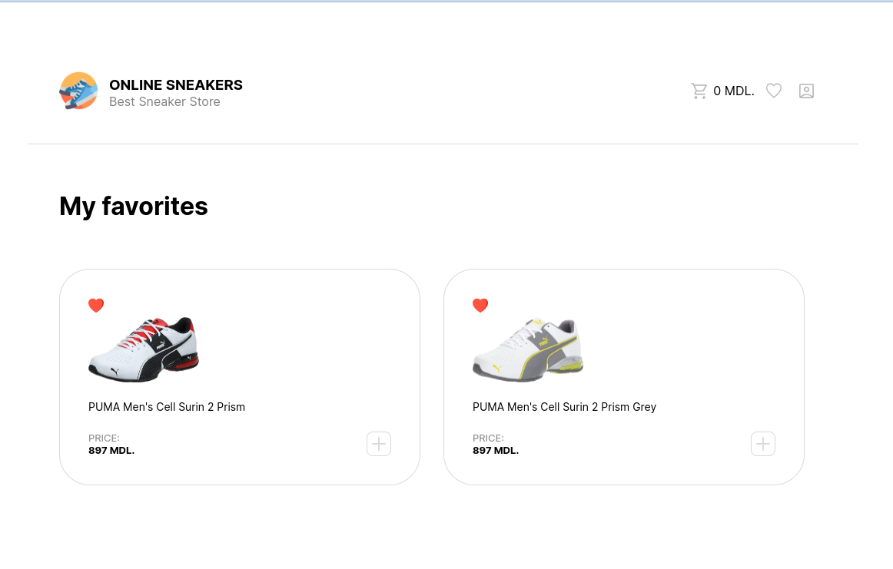

# 👟 Online Sneakers 👟
Emitation of simple online store
## ⚒️ Technologies

- **ReactJS 18**
- **React Router v6** (navigation)
- React Hooks
- React Content Loader
- SCSS


### 🌐 More about this technologies

- [React Router v6](https://reactrouter.com/en/v6.3.0/getting-started/overview) — used to create navigation on our website without reloading the page.
- [React Hooks](https://en.reactjs.org/docs/hooks-intro.html) — this is a set of ready-made functions within the React library for solving various tasks, for example, storing data, defining the first display of the application, optimizing functions and more.
- [SCSS](https://sass-scss.ru/) — it's the same CSS, but with more powerful features, functions, variables, cycles and a bunch of other cool solutions.

## ⚙️ Instructions

Install dependencies and node_modules folder with:

```
npm install
```

Open project in developer mode: 

```
npm start
```

### 📂 Project Snapshots

#### Home-Page

--------------------------------------------------
#### Search-Filter

--------------------------------------------------
#### Cart

--------------------------------------------------
#### Cart-Empty

--------------------------------------------------
#### Favorites-Page

--------------------------------------------------